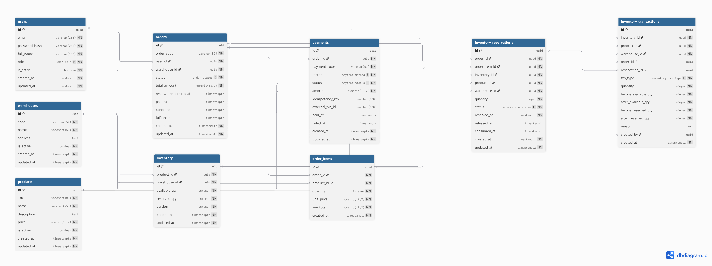

# StockFlow

## Overview

A mini e-commerce backend focused on **order lifecycle**, **inventory consistency**, and **modular backend design**:

- Manage core resources such as **users**, **products**, and **warehouses**
- Create and track **warehouse orders** with item-level data
- Handle **inventory adjustment** and inspect **inventory transaction history**
- Simulate a basic **payment flow** with checkout and callback endpoints
- Use **PostgreSQL transactions** for important write flows
- Add **Redis-based rate limiting middleware** to protect the API surface
- Organize the codebase using a **module-first architecture** with **handwritten SQL**

This project is built as a practical backend showcase for an **Intern Backend portfolio**. The goal is not to build a full production marketplace, but to model the backend foundation of a **mini e-commerce / warehouse order management system** with realistic service boundaries.

## Tech Stack

- **Go**
- **Gin** (HTTP framework)
- **PostgreSQL 16**
- **pgx / pgxpool**
- **Redis 7**
- **Docker / Docker Compose**
- **Handwritten SQL** (no ORM)

## Features

### 1) Product Management

- Create products
- Get product detail by ID
- List products with paging
- Product data is stored in **PostgreSQL** and exposed through thin **Gin handlers**

### 2) Warehouse Management

- Create warehouses
- Get warehouse detail by ID
- List warehouses with paging
- Warehouses act as **inventory locations** for stock operations and order fulfillment

### 3) User Management

- Create users
- Get user detail by ID
- Update user information
- List users with paging

### 4) Inventory Management

- Adjust stock quantities through a dedicated inventory endpoint
- Read inventory detail for a product in a warehouse
- Inspect inventory transaction history
- Inventory logic is separated into **entity models**, **use cases**, and **SQL storage**

### 5) Order Flow

- Create orders with order items
- Get order detail by ID
- List orders with paging/filter support in the module design
- Cancel an order
- Expire an order
- Important order writes are implemented through **transactional storage code**

### 6) Payment Flow

- Create checkout payment records
- Receive payment callback updates
- Get payment detail by ID
- List payments with paging
- Payment status transitions are modeled in a separate **module**

### 7) Redis Rate Limiting

- Global **Gin middleware** backed by **Redis**
- Helps mitigate **API abuse** during local testing and demo scenarios

### 8) Dockerized Local Environment

- Runs **PostgreSQL** and **Redis** with **Docker Compose**
- Application configuration is driven through **.env**

### 9) Experimental Outbox Module

- The repository contains an **outbox module** with enqueue/list/mark endpoints
- In the current source state, this module exists as infrastructure groundwork and is not yet a core integrated business flow

## Database Schema



## System Architecture

This backend can be viewed as a mini e-commerce architecture centered on **product catalog**, **warehouse stock**, **customer orders**, and **payment processing**.

```text
┌──────────────────────────────────────────────────────────────────┐
│                          Client / Postman                        │
└──────────────────────────────────────────────────────────────────┘
                               │
                               ▼
┌──────────────────────────────────────────────────────────────────┐
│                       Gin HTTP API Layer                         │
│  /users  /products  /warehouses  /inventories  /orders  /payments│
└──────────────────────────────────────────────────────────────────┘
                               │
                               ▼
┌──────────────────────────────────────────────────────────────────┐
│                     Module-First Application                     │
│                                                                  │
│  User Module        Product Module        Warehouse Module       │
│  Inventory Module   Order Module          Payment Module         |│                                                                  │
└──────────────────────────────────────────────────────────────────┘
                               │
                ┌──────────────┴──────────────┐
                ▼                             ▼
┌──────────────────────────────┐   ┌──────────────────────────────┐
│ PostgreSQL                   │   │ Redis                        │
│ - users                      │   │ - rate limit counters        │
│ - products                   │   │ - short-lived cache/limits   │
│ - warehouses                 │   └──────────────────────────────┘
│ - inventory / transactions   │
│ - orders / order_items       │
│ - payments                   │
│ - outbox_events              │
└──────────────────────────────┘
```

## Domain View

- Users place or own **orders**
- Products are stored in **warehouses**
- Inventory tracks available stock per **warehouse/product** pair
- Orders contain one or more **order items**
- Payments track **checkout** and **callback** state for orders
- Outbox is intended for asynchronous event recording, but is currently infrastructure-level rather than a fully integrated runtime flow

## Request Flow

1. Client calls a Gin endpoint
2. Handler validates/binds request and delegates to **biz/**
3. **biz/** executes the use case and calls **storage/**
4. **storage/** runs handwritten SQL against **PostgreSQL**
5. **Redis middleware** applies request throttling before protected routes are processed

## Mini E-commerce Scope

This project models the backend foundation of a simplified commerce system:

- **Catalog**: products
- **Operations**: warehouses and inventory control
- **Sales flow**: order creation and status changes
- **Payment flow**: checkout and callback
- **Platform concerns**: rate limiting, SQL transactions, modular structure

It is best described as a warehouse-oriented mini e-commerce backend, not a full marketplace. The system emphasizes backend engineering concerns more than front-end customer features.

## Main API Groups

### Users

- POST /users
- GET /users
- GET /users/:id
- PUT /users/:id

### Products

- POST /products
- GET /products
- GET /products/:id

### Warehouses

- POST /warehouses
- GET /warehouses
- GET /warehouses/:id

### Inventories

- POST /inventories/adjust
- GET /inventories/detail
- GET /inventories/transactions

### Orders

- POST /orders
- GET /orders
- GET /orders/:id
- POST /orders/:id/cancel
- POST /orders/:id/expire

### Payments

- POST /payments/checkout
- POST /payments/callback
- GET /payments
- GET /payments/:id

### Outbox (experimental)

- POST /outbox/events
- GET /outbox/events
- POST /outbox/events/:id/processed
- POST /outbox/events/:id/failed

## Project Structure

```text
stockflow/
├── main.go                                      # Composition root: load env, init Postgres/Redis, attach middleware, register all module routes, expose /health
├── Dockerfile                                   # Multi-stage image build for running the Go API in Docker
├── docker-compose.yml                           # Local infrastructure orchestration for PostgreSQL and Redis
├── .env                                         # Runtime configuration: DB_DSN, REDIS_ADDR, PORT
├── go.mod                                       # Go module definition and direct dependencies
├── go.sum                                       # Dependency lock/checksum file
├── README.md                                    # Project README
├── StockFlow.png                                # Project asset / image used for documentation
│
├── component/
│   ├── postgres/
│   │   └── postgres.go                          # pgxpool initialization helper for PostgreSQL connection pooling
│   │
│   ├── redis/
│   │   └── redis.go                             # Redis client initialization helper
│   │
│   └── ratelimit/
│       └── limiter.go                           # Redis-backed rate limiter implementation
│
├── middleware/
│   └── ratelimit.go                             # Gin middleware wrapper that applies the Redis limiter to incoming requests
│
├── db/
│   └── init/                                    # DB bootstrap folder; currently empty in repository, no SQL migration/init files present
│
└── module/
    ├── user/
    │   ├── model/
    │   │   ├── user.go                          # User entity, create/update request DTOs, response-facing structures
    │   │   ├── paging.go                        # Shared paging structure for list users API
    │   │   └── errors.go                        # User module custom domain/validation errors
    │   │
    │   ├── biz/
    │   │   ├── create_user.go                   # Use case: validate input and create a user
    │   │   ├── get_user.go                      # Use case: fetch user detail by ID
    │   │   ├── list_users.go                    # Use case: list users with paging
    │   │   └── update_user.go                   # Use case: update user information
    │   │
    │   ├── storage/
    │   │   ├── sql.go                           # User SQL store root, shared DB handle abstraction
    │   │   └── sql_user.go                      # Handwritten SQL queries for create/get/list/update user
    │   │
    │   └── transport/gin/
    │       ├── routes.go                        # Register /users routes into Gin router
    │       ├── create_user_handler.go           # HTTP handler: POST /users
    │       ├── get_user_handler.go              # HTTP handler: GET /users/:id
    │       ├── list_users_handler.go            # HTTP handler: GET /users
    │       └── update_user_handler.go           # HTTP handler: PUT /users/:id
    │
    ├── product/
    │   ├── model/
    │   │   ├── product.go                       # Product entity, create request DTO, response-facing structures
    │   │   ├── paging.go                        # Paging structure for product listing
    │   │   └── errors.go                        # Product module custom errors
    │   │
    │   ├── biz/
    │   │   ├── create_product.go                # Use case: validate input and create product
    │   │   ├── get_product.go                   # Use case: fetch product detail by ID
    │   │   └── list_products.go                 # Use case: list products with paging
    │   │
    │   ├── storage/
    │   │   ├── sql.go                           # Product SQL store root
    │   │   └── sql_product.go                   # Handwritten SQL queries for create/get/list product
    │   │
    │   └── transport/gin/
    │       ├── routes.go                        # Register /products routes
    │       ├── create_product_handler.go        # HTTP handler: POST /products
    │       ├── get_product_handler.go           # HTTP handler: GET /products/:id
    │       └── list_products_handler.go         # HTTP handler: GET /products
    │
    ├── warehouse/
    │   ├── model/
    │   │   ├── warehouse.go                     # Warehouse entity, create request DTO, response-facing structures
    │   │   ├── paging.go                        # Paging structure for warehouse listing
    │   │   └── errors.go                        # Warehouse module custom errors
    │   │
    │   ├── biz/
    │   │   ├── create_warehouse.go              # Use case: validate input and create warehouse
    │   │   ├── get_warehouse.go                 # Use case: fetch warehouse detail by ID
    │   │   └── list_warehouses.go               # Use case: list warehouses with paging
    │   │
    │   ├── storage/
    │   │   ├── sql.go                           # Warehouse SQL store root
    │   │   └── sql_warehouse.go                 # Handwritten SQL queries for create/get/list warehouse
    │   │
    │   └── transport/gin/
    │       ├── routes.go                        # Register /warehouses routes
    │       ├── create_warehouse_handler.go      # HTTP handler: POST /warehouses
    │       ├── get_warehouse_handler.go         # HTTP handler: GET /warehouses/:id
    │       └── list_warehouses_handler.go       # HTTP handler: GET /warehouses
    │
    ├── inventory/
    │   ├── model/
    │   │   ├── inventory.go                     # Inventory entity/detail DTOs
    │   │   ├── inventory_transaction.go         # Inventory transaction entity/history DTOs
    │   │   ├── inventory_reservation.go         # Reservation-related model definitions
    │   │   ├── paging.go                        # Paging structure for transaction history
    │   │   └── errors.go                        # Inventory module custom errors
    │   │
    │   ├── biz/
    │   │   ├── adjust_stock.go                  # Use case: adjust stock quantity
    │   │   ├── get_inventory.go                 # Use case: fetch inventory by warehouse/product
    │   │   └── list_inventory_transactions.go   # Use case: list inventory transaction history
    │   │
    │   ├── storage/
    │   │   ├── sql.go                           # Inventory SQL store root + shared helpers
    │   │   ├── sql_inventory.go                 # SQL for reading/updating inventory records
    │   │   ├── sql_inventory_transaction.go     # SQL for inventory transaction insert/list
    │   │   └── sql_inventory_reservation.go     # SQL related to inventory reservation persistence
    │   │
    │   └── transport/gin/
    │       ├── routes.go                        # Register inventory routes
    │       ├── adjust_stock_handler.go          # HTTP handler: POST /inventories/adjust
    │       ├── get_inventory_handler.go         # HTTP handler: GET /inventories/detail
    │       └── list_inventory_transactions_handler.go # HTTP handler: GET /inventories/transactions
    │
    ├── order/
    │   ├── model/
    │   │   ├── order.go                         # Order entity, create request, order detail/list DTOs
    │   │   ├── order_item.go                    # Order item entity and request/response models
    │   │   ├── filter.go                        # Filter structure for listing orders
    │   │   ├── paging.go                        # Paging structure for order list
    │   │   └── errors.go                        # Order module custom errors
    │   │
    │   ├── biz/
    │   │   ├── create_order.go                  # Use case: create order with items
    │   │   ├── get_order.go                     # Use case: fetch order detail by ID
    │   │   ├── list_orders.go                   # Use case: list orders with paging/filter
    │   │   ├── cancel_order.go                  # Use case: cancel an order
    │   │   └── expire_order.go                  # Use case: expire an order
    │   │
    │   ├── storage/
    │   │   ├── sql.go                           # Order SQL store root + transaction helper
    │   │   ├── sql_order.go                     # SQL for order CRUD-like reads/writes
    │   │   ├── sql_order_item.go                # SQL for persisting and reading order items
    │   │   └── sql_order_tx.go                  # Transactional SQL flow for order creation/status changes
    │   │
    │   └── transport/gin/
    │       ├── routes.go                        # Register /orders routes
    │       ├── create_order_handler.go          # HTTP handler: POST /orders
    │       ├── get_order_handler.go             # HTTP handler: GET /orders/:id
    │       ├── list_orders_handler.go           # HTTP handler: GET /orders
    │       ├── cancel_order_handler.go          # HTTP handler: POST /orders/:id/cancel
    │       └── expire_order_handler.go          # HTTP handler: POST /orders/:id/expire
    │
    ├── payment/
        ├── model/
        │   ├── payment.go                       # Payment entity, checkout/callback request DTOs
        │   ├── filter.go                        # Filter structure for payment listing
        │   ├── paging.go                        # Paging structure for payment list
        │   └── errors.go                        # Payment module custom errors
        │
        ├── biz/
        │   ├── checkout.go                      # Use case: create payment/checkout record
        │   ├── callback.go                      # Use case: handle payment callback status update
        │   ├── get_payment.go                   # Use case: fetch payment detail by ID
        │   └── list_payments.go                 # Use case: list payments with paging/filter
        │
        ├── storage/
        │   ├── sql.go                           # Payment SQL store root + shared helpers
        │   ├── sql_payment.go                   # SQL for payment reads/writes
        │   └── sql_payment_tx.go                # Transactional SQL for payment state changes when needed
        │
        └── transport/gin/
            ├── routes.go                        # Register /payments routes
            ├── checkout_handler.go              # HTTP handler: POST /payments/checkout
            ├── callback_handler.go              # HTTP handler: POST /payments/callback
            ├── get_payment_handler.go           # HTTP handler: GET /payments/:id
            └── list_payments_handler.go         # HTTP handler: GET /payments
    
    
```

## Module-First Layering

Each module follows a consistent internal structure:

**transport/gin**  -> HTTP handlers and route registration
**storage**        -> handwritten SQL and DB access
**biz**            -> use-case orchestration and business rules
**model**          -> entities, DTOs, filters, paging, errors

This keeps handlers thin, avoids **ORM coupling**, and makes it easier to reason about each domain separately.

## Clean Architecture View

```text
┌─────────────────────────────────────────────┐
│         Transport (Driver)                  │
│      module/*/transport/gin                 │
└─────────────────────────────────────────────┘
                     │
                     ▼
┌─────────────────────────────────────────────┐
│         Storage (Adapters)                  │
│           module/*/storage                  │
└─────────────────────────────────────────────┘
                     │
                     ▼
┌─────────────────────────────────────────────┐
│          Biz (Use-Case)                     │
│             module/*/biz                    │
└─────────────────────────────────────────────┘
                     │
                     ▼
┌─────────────────────────────────────────────┐
│         Models (Entities)                   │
│            module/*/model                   │
└─────────────────────────────────────────────┘
```

